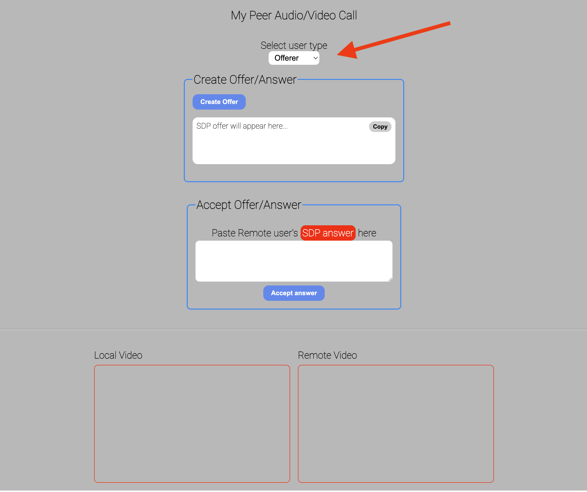
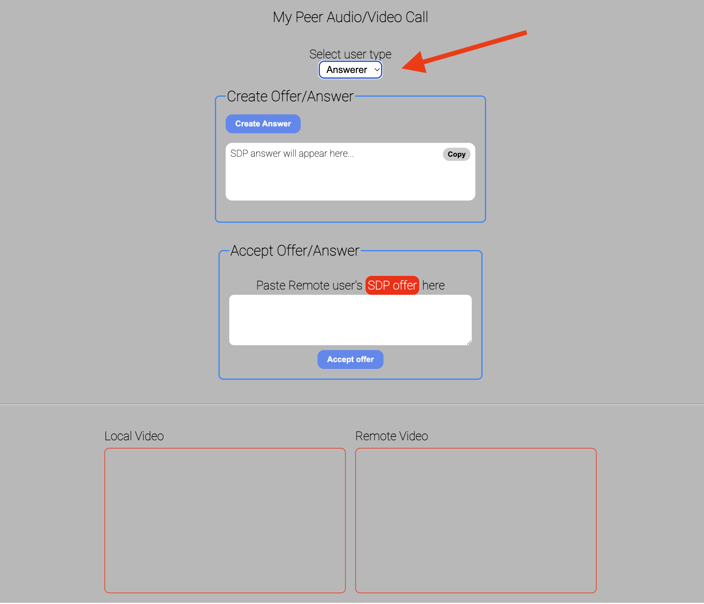

# WebRTC Learning

This repository contains the sample projects (POCs) for various WebRTC flows.

Please read through below about each of the samples and follow the instructions to try it out.

## basic-p2p

- After cloning the repo, navigate to `basic-p2p` folder
- Run `npm install`
- Run `npm start`

You will see the below UIs

Now open the above two screens in two different browsers and do the following

- Offerer screen: Click `Create offer` and copy the SDP offer
- Answerer screen: Paste the SDP offer in the accept offer and click `Accept offer`
- Answerer screen: Click `Create Answer` and copy SDP answer
- Offerer screen: Paste the SDP answer and click `Accept answer`

After doing above steps, the connection should get established.

**Note**: Don't forget to give media permission when asked
